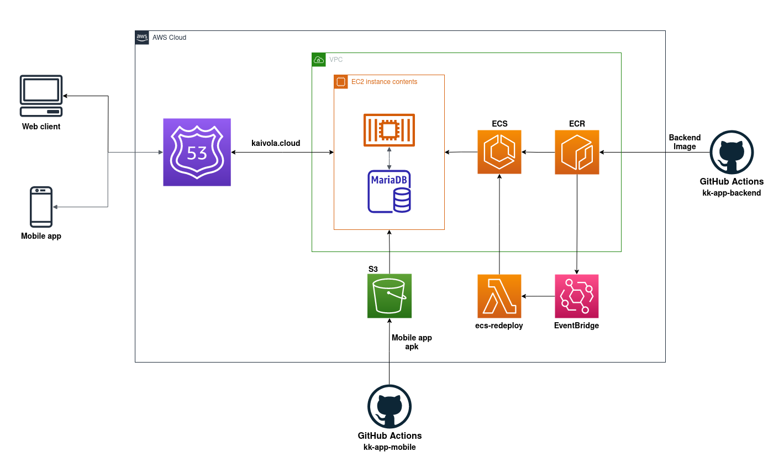

<!-- About the Project -->
## About kk-app
Small app for transportation companies that allows drivers to save information about cargo. The project consists of a web dashboard for supervisors and an Android app for drivers.

You can find the source codes for the different parts of the project in their own repositories:

[Mobile app](https://github.com/kaivola/kk-app-mobile)

[Web](https://github.com/kaivola/kk-app-frontend)

[Backend](https://github.com/kaivola/kk-app-backend)

### Live demo

You can try out the dashboard at https://demo.kaivola.cloud  
Username: demo  
Password: demo

<!-- TechStack -->
### Tech Stack

  
Web

  <ul>
    <li>React</li>
    <li>TypeScript</li>
    <li>Next.js 13</li>
    <li>Tailwind CSS</li>
  </ul>

  
Mobile

  <ul>
    <li>Kotlin</li>
    <li>JetPack Compose</li>
    <li>Retrofit2</li>
  </ul>

  
Server

  <ul>
    <li>Java</li>
    <li>Spring Boot</li>
    <li>MariaDB</li>
  </ul>

DevOps

  <ul>
    <li>Git</li>
    <li>GitHub Actions</li>
    <li>Docker</li>
  </ul>

Cloud

  <ul>
    <li>EC2</li>
    <li>ECS</li>
    <li>ECR</li>
    <li>S3</li>
    <li>Lambda</li>
  </ul>

### AWS Diagram

## Todo

#### Mobile
* [ ] Add waybill view
* [x] Finish authentication
* [x] Add http request caching
* [x] Implement in-app updating
   
#### Web
* [ ] Table sorting
* [x] Implement authentication
* [x] Generic table component with filtering and pagination
* [x] Deploy on AWS
* [x] Switch to Next.js 13
* [x] Switch to Tailwind CSS  

#### Backend
* [ ] Read cargo information from pictures using OCR
* [x] Serve mobile app apks from S3 bucket
* [x] Controller level exception handling
